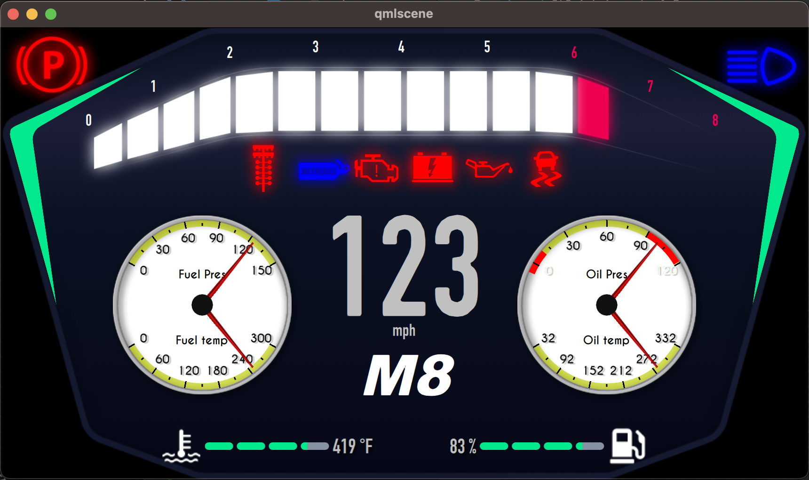

# Custom-Haltech-IC7-Layout
Experimental repo used to design custom Haltech IC7 layouts using Qt Studio and QML

> **Warning**
> Not responsible for any damages, be very careful here! Though no firmware is edited here, **so in theory**, all work here is safe. You would get an error in IC software before you can upload to hardware if you mess something up.


> The above layout can be found under the [v0 branch](https://github.com/MarcL01/Custom-Haltech-IC7-Layout/tree/v0-layout-experiment), you can see what I changed [here](https://github.com/MarcL01/Custom-Haltech-IC7-Layout/compare/main...v0-layout-experiment)

# How do I use this?

> **Note**
> The `main` branch is the default Haltech V2 map qml files. This way you can clone `main` and have a clean slate to make your own changes. If you want to use one of my layout designs, checkout one of the other branchs.

1. Load up a map in IC software (for starting off I recommend default map)

2. Click on any screen that is not 7 (you don't want to have the screen your are changing open)

3. Open File Explorer and go to "%appdata%"

4. Go into Haltech -> Dash -> qmlroot

5. Copy the `data`, `images`, `qml` and `styles` folders from this repo into that directory and replace files

6. Click on the screen you made changes to, this will reload & rebuild the qml files and should reflect changes made to that screen.

# Setup

1. Download Qt Creator and Qt 5.15.2 (download the Qt Open Source Online Installer [here](https://www.qt.io/download-qt-installer-oss))

2. Clone the repo

3. Open the repo project in Qt Creator

4. Open `qml/user_screens/Screen_07.qml` and swap the comments for DataMapAddress.
    - So this:
        ```
        import DataMapAddressEnums 1.0
        //import "DataMapEnums.js" as DataMapAddress
        ```
    - Will become this:
        ```
        //import DataMapAddressEnums 1.0
        import "DataMapEnums.js" as DataMapAddress
        ```

5. Press the start button and assuming you have a working Qt Kit, you should see screen 7 open in Qt. Start button looks like this:


6. Make changes to your heart's content.

7. Before you transfer your changes back to IC software you must undo the comment change done in step 4.

# What files/dirs matter?

- `data/GaugeSettings.json` - contains gauge settings that are used in the IC software, these are not used when running in Qt Creator

- `qml/factory_screens/channels.js` - contains the x,y,width,height of every channel that is clickable in the IC software; when you click on a gauge to simulate it's value or change its unit/data type.

- `qml/user_components/` - contains all of the components (gauges, alerts, tell tale lights, etc)

- `qml/user_screens/` - contains all of the screens

- `qml/images/` - contains all of the images, you can add your own custom images and reference them in QML.

- `qml/styles/` - contains fonts and qml style object. You can add custom fonts and reference them in QML.